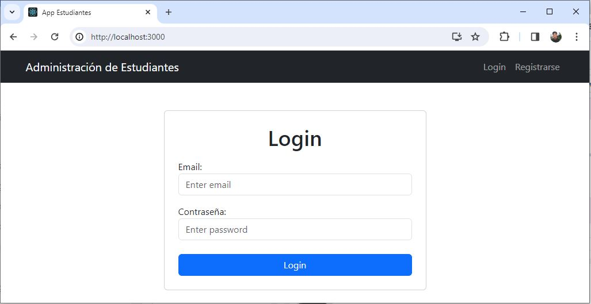
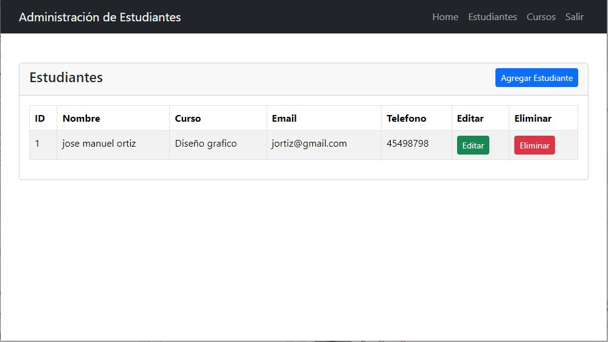
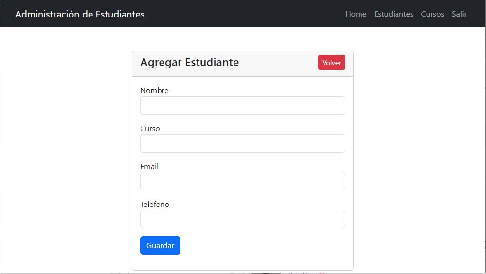

## Prueba Técnica - PHP

Integrar React.js con Laravel para dearrollar la Autenticación y Registro de Usuarios, y operaciones CRUD.

## Requerimientos
PHP 8.0.2, Laravel 4.5.1, MariaDB 5.7, Node 18.17.1

## Screenshots





## Installation
1- Clonar repositorio ```git clone https://github.com/cgonzalez26/pruebatecnica_php.git```
2- Cambiar a directorio ```cd pruebatecnica_php/backend```
3- Instalar dependencias ```composer install```

- Instalar Base de Datos
4- Copiar archivo .env ```cp .env.example .env```
5- Ejecutar ```php artisan key:generate```
6- Especificar db_name, username y password, con la configuracion de tu Base de Datos en archivo .env
7- Migrar ```php artisan migrate --seed```
8- Ejecutar proyecto backend ```php artisan serve```

- Instalar Node modules en frontend
8- Cambiar a directorio ```cd pruebatecnica_php/frontend``
9- Ejecutar ```npm install```
10- Ejecutar proyecto frontend ```npm start```